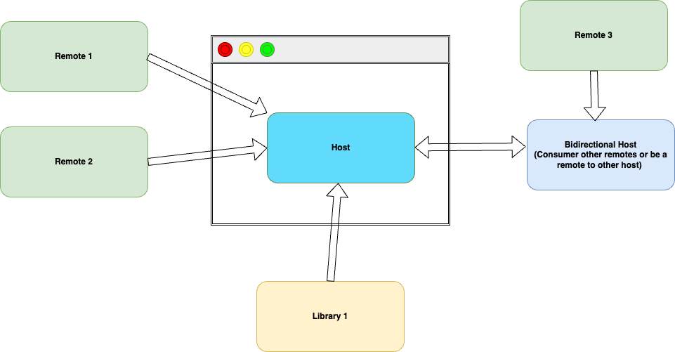

# Module Federation

> Module Federation aims to solve the sharing of modules in a distributed system. It allows you to ship those critical shared pieces as macro or as micro as you would like. It does this by pulling them out of the build pipeline and out of your apps


Module Federation is an alternative way of building microfrontends. single-spa can be thought of an **orchestration** type of framework of building frameworks while Module federation is an **choreography** based approach. There is still a host/shell that orchestrates in Module Federation but its role is limited when compared to single-spa's orchestration which includes its Layout engines for routing, import overrides etc


## Architecture 


### Components




1. Host: Host shell that orchestrates the application

2. Remote


3. Biderectional Host

4. Library

### Shared API

Module federation has a shared API which is the common configuration in all microfrontends

A sample Module Federation config in Webpack:

```javascript
 new ModuleFederationPlugin({
      name: 'app1',
      filename: 'remoteEntry.js',
      exposes: {
        './PageHeader': './src/Components/PageHeader',
        './CardList': './src/Components/CardList',
      },
      shared: { react: { singleton: true }, 'react-dom': { singleton: true } },
    })
```

1. `name`: Name of Microfrontend application. This is known as **remote**.

2. `filename` for `remoteEntry.js`: Name of remoteEntry file. remoteEntry file is important as it holds metadata as a JSON file. The JSON lists all modules, functions exposed by the remote microfrontend.

3. `exposes`: Lists all the components/modules exposed by the remote microfrontend applciation.

4. `shared`

Allows de-duplication of libraries that are shared scross federated microfrontends. For example, a library such as `loadash` can be put in shared. Other examples include React, React Router etc

```
new ModuleFederationPlugin({
  ...
  shared: ["lodash"],
});
```

-  `eager`
    - `true`: Dependency will be eagerly loaded and made available to other microfrontend apps as soon as the host application starts.
    - `false`: Dependency will be lazily loaded when it is first requested by the specific microfrontend.


- `singleton` and `requiredVersion`
    - If `singleton` is true, then the depdendency will be loaded only once and shared across all microfrontends.
    - `requiredVersion` specifies required version of depedency.  If a microfrontend tries to load an incompatible version of dependency, two copies are loaded. If the singleton option is set to true, a warning will be printed in the console.

Example configuration:


```
shared: {
  react: {
    singleton: true,
    requiredVersion: "^18.0.0",
  },
  "react-dom": {
    singleton: true,
    requiredVersion: "^18.0.0"
  },
}
```


## Using with other bundlers

It started as a Webpack 5 project, but has grown as an ecosystem to support all kinds of bundlers. Other projects achieve federation by following the Module Federation API such as `remote`, `shared` and `exposes`

1. [Vite Plugin Federation](https://github.com/originjs/vite-plugin-federation)
2. [Angular's Native Federation](https://www.angulararchitects.io/blog/announcing-native-federation-1-0/)

NOTE: It is recommended to not inter-mix Module bundlers such as Vite (Rollup as of 2024, Rolldown later) and Webpack, as the underneath structure might cause JS chunks to be incompatible. 