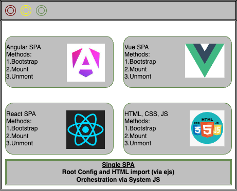

# Singla SPA


A framework that allows to build mirofrontends. Its feature includes:
1. Mounting UI applications using most UI frameworks as Angular, React, Vue, AngularJS, Svelte, Alpine etc (See [here](https://single-spa.js.org/docs/ecosystem#help-for-frameworks))
2. Deploy microfrontends independently
3. Lazy load UI code to improve intital page load time.


## Architecture

Single SPA consists of 2 components

1. Root Config: Orchestrates the loading of shell application in the browser
2. Applications: The independently deployable frontends can attach to the Root Config (aka Orchestrator aka Shell) 




### Single SPA Root

> Synonymous to Root: Shell, Orchestrator

SingleSPA is an orchestrator that 
1. Renders the HTML page 
2. Registering individual micro-frontend application using its Javascript engine (SystemJS or Module-federation based)
3. Handling Routing for different microfrontends

From the code point-of-view, the root requires 2 files

1. **Root config:**:  Has all the configuration with respect to route, app and other imports (CSS, etc). Finally, all these information is used to call `singleSpa.registerApplications`
2. **Root HTML of SingleSPA**: HTML which has information to render the micro-frontend applications. 

Sample code of SingleSPA's root config:

```javascript
// single-spa-config.js
import { registerApplication, start } from "single-spa";

// 3. Construct routes from Page Header aka Nav component
const routes = constructRoutes(document.querySelector("#single-spa-layout"), {
  loaders: { pageHeader: "<h1>Loading PageHeader</h1>"}
});

// 2.a. Add routes 
const apps = constructApplications({routes, loadApp: ({ name }) => System.import(name)});
// 1.b. SingleSPA's Layout Engine for rendering HTML
const layoutEngine = constructLayoutEngine({routes,apps,active: false});

// 2.b. Register application
apps.forEach(registerApplication);

// 1. SystemJS import
System.import("@react-mf/styleguide").then(() => {layoutEngine.activate();start();});
```


2. **Root HTML** of SingleSPA

```html
<!DOCTYPE html>
<html lang="en">
<head>
  <!-- Meta tags --> 
  <title>Single SPA Root config's HTML</title>
  <meta name="importmap-type" content="systemjs-importmap" />
  <script type="systemjs-importmap" src="https://storage.googleapis.com/react.microfrontends.app/importmap.json"></script>
  <script src="https://cdn.jsdelivr.net/npm/import-map-overrides@2.2.0/dist/import-map-overrides.js"></script>
  <script src="https://cdn.jsdelivr.net/npm/systemjs@6.8.3/dist/system.min.js"></script>
  <script src="https://cdn.jsdelivr.net/npm/systemjs@6.8.3/dist/extras/amd.min.js"></script>
  <template id="single-spa-layout">
    <single-spa-router>
      <nav class="pageHeader"><application name="@react-mf/navbar" loader="pageHeader"></application></nav>
      <div class="main-content mt-16">
        <route path="card">
          <application name="@react-mf/people"></application>
        </route>
        <route path="prepaid">
          <application name="@react-mf/prepaid"></application>
        </route>
        <redirect from="/crossborder" to="/card"></redirect>
        <route default>
          <h1>
            <p>This example project shows independently built and deployed microfrontends that use React and single-spa. Each nav link above takes you to a different microfrontend.</p>
          </h1>
        </route>
      </div>
    </single-spa-router>
  </template>
</head>
<body>
  <script>
    System.import('@react-mf/root-config');
    System.import('@react-mf/styleguide');
  </script>
  <import-map-overrides-full show-when-local-storage="devtools" dev-libs></import-map-overrides-full>
</body>
</html>
```

You can also add shared depdencies to reduce duplicate downloads of Javascript libraries. An example would be React-based dependencies which are used by at least 2 micro-frontend applications:

```
"react": "https://cdn.jsdelivr.net/npm/react@17.0.2/umd/react.production.min.js",
"react-dom": "https://cdn.jsdelivr.net/npm/react-dom@17.0.2/umd/react-dom.production.min.js"
```


#### Layout Engine


`single-spa-layout` is an optional package to single-spa that handles routing. It handles these requirements:
1. Handle 404/Not found pages
2. Error pages
3. Loading UIs whilst the application is getting loaded
4. SSR of micro-frontends

In the root HTML, you can see it in action under the `<single-spa-router>` HTML tag.

### Micro-frontend Applications

Every UI frontend application can be written in any framework (React, Angular, Vue, whatever JS hyped-up framework of the day is etc) and Module Bundler (Webpack, Parcel, Rollup, JS import etc) can be imported. The apps need to add Single-SPA config for registering the lifecycle methods (i.e Bootstrap, Mount and Unmount methods)


1. Bootstrap: Called once, just before mounting the registered microfrontend applicaiton.
2. Mount: Used to insert applications into DOM. Rsponsible for creating DOM Elements, Event listeners etc
3. Unmount: Clean up DOM Elements, Event Listeners, Memory leaks, Global variables (`window.*` etc) that were created when application was mounted.


Sample code of a React application registering

```
const lifecycles = singleSpaReact({
  React,
  ReactDOM,
  errorBoundary() {return <div>Error</div>;},
  loadRootComponent: () =>
    import(
      /* webpackChunkName: "people-root-component" */ "./root.component.js"
    ).then((mod) => mod.default),
});

export const bootstrap = lifecycles.bootstrap;
export const mount = lifecycles.mount;
export const unmount = lifecycles.unmount;

export function getCardComponent() {
  return import(
    /* webpackChunkName: "card-component" */ "./cards/card.component.js"
  );
}
```


### Additional topics


Apart from application, SingleSPA has 2 other types of microfronend types:

1. Parcel: These are used to have reusable UI components across multiple frameworks. Read more about Parcel [here](https://single-spa.js.org/docs/parcels-overview)

> Note that Parcel is also a module bundler (like Webpack, Rollup) that is different from SingleSPA use of its ***Parcel*** concept.

2. Utility: Helper methods that cna be shared to have consistent functions, shared bunsiness logic   and removing code duplicacy.

|Topic|	Application|	Parcel	|Utility|
|---|---|---|---|
|Routing|Has multiple routes|Has no routes	|Has no routes|
|API|Declarative API|Imperative API	|Exports a public interface|
|Renders UI	|Renders UI|Renders UI	|May or may not render UI|
|Lifecycles	|single-spa managed lifecycles(bootstrap, mount and unmount)|Custom managed lifecycle(Using API such as `mountParcel` etc)|	external module: no direct single-spa lifecycles|
|When to use|Core building block| Only needed with multiple frameworks|Useful to share common logic, or create a service|


## Testing

### Unit test


Can use the traditional unit test frameworks such as Jest, Enzyme etc for testing individual component.


### E2E test

In Microfrontends, it is recommended to have focus on E2E tests as the most unknowns and regression arise during integrating different microfrontend. [Reference blog](https://kentcdodds.com/blog/the-testing-trophy-and-testing-classifications])


A recommended setup of E2E test would be:

1. Use [import-map-overrides](https://github.com/single-spa/import-map-overrides) to import frontends selectively and in a production-type environment
2. [MC] Build code in an ephemeral build such as Vercel, Netlify or custom ephemeral-hosting provider.
3. Configure E2E test environment to set import-map-overrides
4. Run the tests
